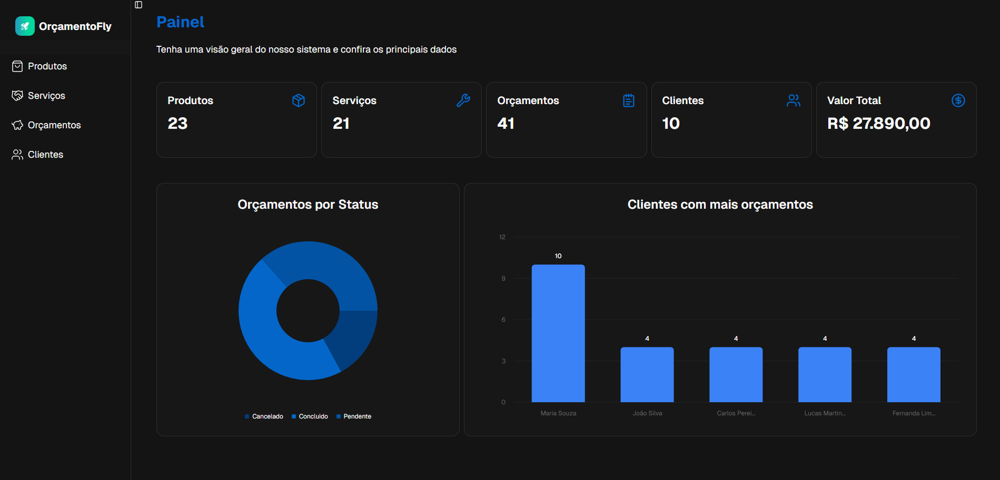

# Sistema de Controle de Orçamentos

## 📌 Descrição
Sistema web desenvolvido em Java com MySQL para gerenciamento de orçamentos contendo produtos e serviços.

O sistema permite cadastrar produtos, serviços e criar orçamentos com múltiplos itens, calculando automaticamente o valor total.

---

## 🎯 Objetivo
Permitir a criação e organização de orçamentos de forma simples, incluindo produtos e serviços em um único documento.

---

## ⚙️ Funcionalidades

### Produtos
- Cadastrar
- Editar
- Excluir
- Listar

### Serviços
- Cadastrar
- Editar
- Excluir
- Listar

### Orçamentos
- Criar orçamento
- Adicionar itens
- Editar itens
- Remover itens
- Calcular total
- Listar orçamentos
- Visualizar detalhes

---

## 🗄️ Estrutura do Banco de Dados

### Tabelas:
- produto
- servico
- orcamento
- orcamento_item

---

## 🔗 Relacionamentos

- orcamento (1:N) orcamento_item
- produto (1:N) orcamento_item
- servico (1:N) orcamento_item

### Regra:
Cada item do orçamento deve ser:
- um produto OU
- um serviço

---

## 🧠 Regras de Negócio

- subtotal = quantidade × valor_unitario
- valor_total = soma dos itens
- orçamento deve ter pelo menos 1 item
- produtos possuem estoque
- serviços não possuem estoque

---

## 🏗️ Arquitetura

Estrutura sugerida:

src/
 ├── model  
 ├── dao  
 ├── controller (Servlets)  
 ├── service  
 └── util  

---

## 🧩 Padrões Utilizados

### dao
Responsável pelo acesso ao banco de dados.

### MVC
Separação entre:
- Model
- View
- Controller

### Service (opcional)
Centraliza regras de negócio.

---

## 🚀 Considerações

Projeto focado em:
- CRUD simples
- boa organização
- modelagem relacional correta

## 🛠️ Comandos

- Frontend => pnpm run dev
- Backend  => ./mvnw spring-boot:run

# TODO:

## Backend

- [] - 

## Frontend

- [x] - Adicionar tabela "Cliente"
- [] - Adicionar funcionalidade de adicionar items nos orçamentos
- [] - Adicionar validação de preços negativos nas tabelas
- [] - Adicionar "status" nos Orçamentos
- [] - Adicionar gráficos no painel
- [] - Adicionar produtos no orçamentos

# Client table

- id			- number
- nome			- string
- email			- string
- telefone	 	- number
- cpf			- string
- cep			- string
- endereço		- string
- sexo			- string
- dataNascimento		- Date
- criadoEm		- Date
