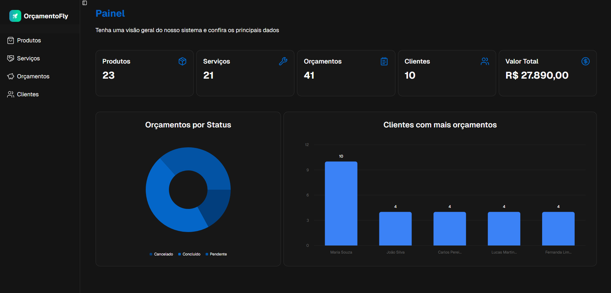

# OrcamentoFly
## Sistema de Controle de Orçamentos



# Descrição

Sistema web para gerenciamento de clientes, produtos, serviços e orçamentos.

A aplicação permite cadastrar produtos e serviços, controlar estoque, gerenciar clientes e criar orçamentos personalizados contendo múltiplos itens.

Além disso, produtos e serviços podem receber funcionalidades adicionais através de microprodutos e microserviços, permitindo personalização e composição dos itens cadastrados.

---

## Objetivo

Facilitar o processo de elaboração e gerenciamento de orçamentos, centralizando informações de clientes, produtos e serviços em uma única plataforma.

---

## Funcionalidades

### Clientes

* Cadastro de clientes
* Edição de clientes
* Exclusão de clientes
* Listagem de clientes

### Produtos

* Cadastro de produtos
* Edição de produtos
* Exclusão de produtos
* Listagem de produtos
* Controle de estoque

### Serviços

* Cadastro de serviços
* Edição de serviços
* Exclusão de serviços
* Listagem de serviços

### Personalização

* Adição de microprodutos aos produtos
* Adição de microserviços aos serviços
* Cálculo automático do valor final dos itens personalizados

### Orçamentos

* Criação de orçamentos
* Associação de orçamento a um cliente
* Inclusão de produtos e serviços
* Remoção de itens
* Atualização de status
* Cálculo automático do valor total
* Consulta e listagem de orçamentos

### Dashboard

* Visualização de gráficos e indicadores do sistema

---

## Regras de Negócio

* Todo orçamento deve estar vinculado a um cliente.
* Produtos possuem controle de estoque.
* Serviços não possuem controle de estoque.
* O valor total do orçamento é calculado automaticamente.
* Um orçamento deve possuir pelo menos um item.
* Produtos e serviços podem receber funcionalidades adicionais através de microprodutos e microserviços.

---

## Tecnologias Utilizadas

### Backend

* Java
* Spring Boot
* Maven

### Frontend

* Next.js
* TypeScript

### Banco de Dados

* MySQL

---

## Como Executar

### Backend

```bash
./mvnw spring-boot:run
```

### Frontend

```bash
pnpm install
pnpm dev
```

---

## Projeto Acadêmico

Projeto desenvolvido para aplicação prática de conceitos de desenvolvimento web, programação orientada a objetos, persistência de dados e integração entre frontend e backend.
